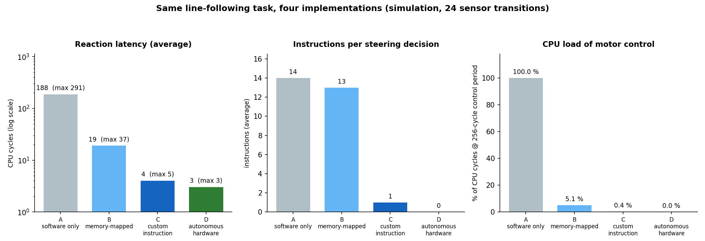

# RISC-V Robotics Processor

A 32-bit **RV32I** processor extended with a **robotics subsystem**: custom instructions, memory-mapped sensor / motor
registers, hardware PWM and an obstacle-stop reflex. Written in Verilog, verified in simulation, and set up for a
**Digilent Basys 3** (Xilinx Artix-7) line-following robot.


-e65100)


## What makes it different

Most student RISC-V projects stop at a general-purpose CPU. This one adds a **robot-specific hardware layer** and
**measures what it buys**:

- **Custom instructions** (`custom-0`): `RSENSOR`, `ROBOTSTEP` (sense -> steer -> drive in one instruction), `MOTORCMD`.
- **Memory-mapped robotics registers** at `0x4000_0000`: sensors, two motor commands, reflex control/status, GPIO.
- **Hardware PWM** (counter / comparator) and a **hardware obstacle reflex** that stops the motors with no software.
- **Autonomous mode**: the steering table runs in hardware every cycle, leaving the CPU free.
- **A measured comparison** of four implementations of the same task (below) against one reference model.

## Measured benchmark

Same task, same 24 sensor transitions, each implementation checked against a reference model (0 missed):

| Implementation | Instructions per steering decision | Reaction latency (cycles, avg / max) | CPU load of motor control |
|---|---|---|---|
| A. Software only (GPIO + software PWM, software obstacle check) | 14 | 188 / 291 | ~100 % (PWM loop never stops) |
| B. Hardware PWM + reflex, software steering (memory-mapped) | 13 | 19 / 37 | 5.1 % |
| C. Hardware PWM + reflex, `ROBOTSTEP` custom instruction | 1 | 4 / 5 | 0.4 % |
| D. Autonomous hardware mode (CPU free) | 0 (none) | 3 / 3 | 0.0 % |



Software PWM keeps the CPU fully busy and reacts in ~190 cycles; the custom instruction reacts in 4 and leaves the CPU
99.6 % free. Details, definitions and caveats: [docs/04_robotics/benchmark.md](docs/04_robotics/benchmark.md).
All numbers are from RTL simulation - no robot measurement is included.

## Verification

| Suite | Scope | Result |
|---|---|---|
| `tb/.test/tb_1c.v` (against the robotics core) | 37 RV32I instructions, 38 checks | **0 faulty instructions** |
| `tb/unit/*` | ALU, PC, register file | all pass |
| `tb/robotics/tb_robotics_*` | unit, MMIO, reflex, motor PWM, standalone top | 20 checks pass |
| `tb/robotics/robot_soc_isa_tb.v` | custom instructions + register map + GPIO executed by the CPU, incl. `lui` | all checks pass |
| `tb/robotics/robot_bench_tb.v` | 4 implementations vs. reference model | 4 / 4 pass |
| `tb/robotics/fpga_top_smoke_tb.v` | Basys 3 top, free-run, PWM duty on the motor pins | pass |

```bash
./simulation/run_t1c.sh            # reference single-cycle core, 38 checks
./simulation/run_unit_tests.sh     # ALU / PC / register file
./simulation/run_robotics.sh       # robotics unit tests, SoC self-test, benchmark, FPGA-top smoke test
```

Requires [Icarus Verilog](https://steveicarus.github.io/iverilog/); the benchmark programs are pre-assembled in
`programs/hex/` (rebuild with `./programs/build.sh`, needs a RISC-V binutils such as `gcc-riscv64-unknown-elf`).

`./programs/build.sh` also regenerates the instruction ROM `rtl/robot_soc/rom_image.v` from
`programs/hex/line_follower.hex` via `programs/hex2rom.py` (generated file - do not edit by hand).

## Repository layout

```
.
├── rtl/
│   ├── t1_riscv_cpu/        Reference single-cycle RV32I CPU (unchanged)
│   ├── robot_cpu/           Robotics variant of the core: custom-0 decode, extra result-mux input, lui fix
│   ├── robot_soc/           CPU + memories + robotics subsystem + address decode
│   ├── robotics/            Robotics subsystem: unit, MMIO, reflex, PWM, GPIO, synchronizer
│   └── core/                SystemVerilog blocks (alu, pc, register_file) with unit tests
├── tb/
│   ├── .test/tb_1c.v        Original 38-check RV32I testbench
│   ├── unit/                ALU / PC / register-file unit tests
│   └── robotics/            Robotics unit tests, SoC self-test, benchmark, FPGA-top smoke test
├── programs/
│   ├── bench/               Four implementations of the line-following task + register-map include
│   ├── demo/                line_follower.S, autonomous.S for the robot
│   ├── test/                rbt_isa_test.S (self-checking)
│   └── hex/                 Assembled images (.hex), listings (.lst), label addresses (.cfg)
├── fpga/
│   ├── basys3/              Reference-core bring-up: single-step clock + ILA, implementation reports
│   └── basys3_robot/        Robot top level, XDC, Vivado rebuild script
├── simulation/              Run scripts, report and chart generators
├── docs/                    Architecture, ISA, robotics, verification, FPGA notes
└── images/                  Diagrams, benchmark chart, simulation waveforms
```

## Documentation

| | |
|---|---|
| [Robotics subsystem](docs/04_robotics/robotics_subsystem.md) | modules, register map, custom-instruction encodings, steering table, core changes |
| [Benchmark](docs/04_robotics/benchmark.md) | method, results, interpretation |
| [Robot bring-up](docs/04_robotics/robot_bringup.md) | wiring, build, first power-up checklist |
| [Core architecture](docs/02_architecture/single_cycle_core.md) | single-cycle datapath, control table, ALU encoding |
| [Verification](docs/05_verification/verification.md) | what is tested and the known gaps |
| [Reference-core FPGA results](docs/06_fpga/basys3_bringup.md) | utilization, timing and power on the Basys 3 |

## Reference core on the Basys 3

The unmodified single-cycle core was implemented on the Basys 3 (`xc7a35tcpg236-1`, Vivado 2025.1) with a single-step
clock and an ILA: 2,576 LUTs, 2,585 registers (including the ILA), 0.099 W estimated, critical path about 13.6 ns
(~73 MHz). The only failing paths are the 129 ILA probe bits crossing from the CPU clock into the 100 MHz debug
clock; details in [docs/06_fpga/basys3_bringup.md](docs/06_fpga/basys3_bringup.md).

## Status and roadmap

- [x] Single-cycle RV32I core, 38 / 38 instruction checks
- [x] Basys 3 bring-up of the reference core (single-step, ILA, bitstream)
- [x] Robotics subsystem integrated in the CPU: custom instructions, MMIO, PWM, reflex, autonomous mode
- [x] Four-way benchmark against a reference model
- [x] Robot top level, constraints and Vivado script for the Basys 3
- [ ] **Hardware run on the robot** (wiring, tuning) - not yet done; no hardware results are claimed here
- [ ] 5-stage pipelined core with forwarding, load-use stall and branch flush
- [ ] Interrupt on `reflex_event`; reverse drive; sensor debounce
- [ ] Open-source ASIC flow (area / frequency / power) for single-cycle vs. pipelined

## Author

**Ashwini Pathak** - [@Ashwini17p](https://github.com/Ashwini17p)

Core developed as part of the e-Yantra Robotics Competition (eYRC) *Logic Quest* RISC-V design track.
