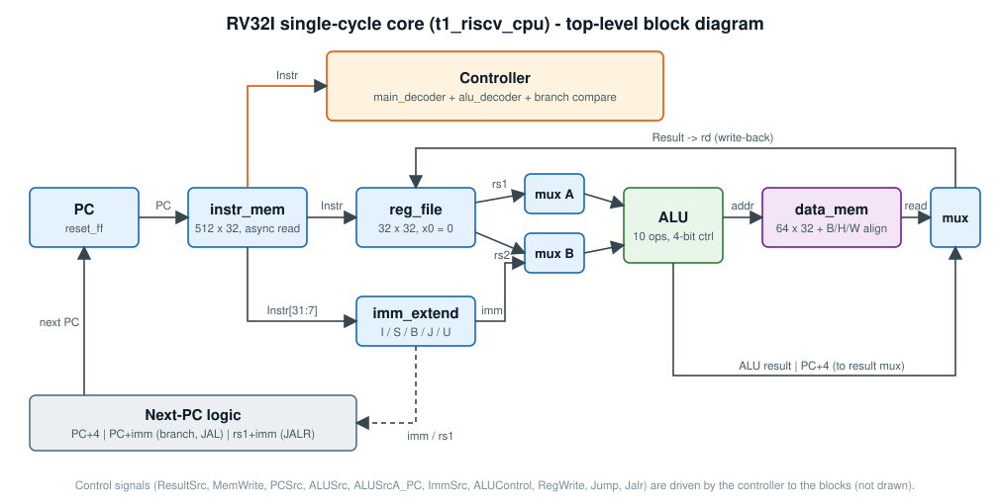

# Single-cycle core architecture



Every instruction completes in one clock: fetch, decode, execute, memory access and register write-back happen in the same
cycle. The clock period is therefore set by the longest combinational path (fetch -> register read -> ALU -> data memory
-> write-back), about 13.6 ns on the Artix-7 build.

## Module hierarchy

```
t1_riscv_cpu
├── riscv_cpu
│   ├── controller      (main_decoder, alu_decoder, branch-condition compare)
│   └── datapath        (reset_ff PC, adders, muxes, reg_file, imm_extend, alu, load/store alignment)
├── instr_mem           512 x 32
└── data_mem            64 x 32
```

## Main decoder

Control word: `RegWrite_ImmSrc_ALUSrc_MemWrite_ResultSrc_Branch_ALUOp_Jump_Jalr_ALUSrcA_PC`

| Instruction class | opcode | ImmSrc | ALUSrc | MemWrite | ResultSrc | ALUOp | Notes |
|---|---|---|---|---|---|---|---|
| load | `0000011` | I (000) | 1 | 0 | 01 (mem) | 00 | add base + offset |
| store | `0100011` | S (001) | 1 | 1 | - | 00 | RegWrite = 0 |
| R-type | `0110011` | - | 0 | 0 | 00 (ALU) | 10 | funct3 / funct7 decide the op |
| I-type ALU | `0010011` | I (000) | 1 | 0 | 00 | 10 | |
| branch | `1100011` | B (010) | 0 | 0 | - | 01 | condition from `funct3` |
| `jal` | `1101111` | J (011) | 0 | 0 | 10 (PC+4) | 00 | Jump = 1 |
| `jalr` | `1100111` | I (000) | 1 | 0 | 10 (PC+4) | 00 | Jump = Jalr = 1 |
| `lui` | `0110111` | U (100) | 1 | 0 | 00 | 00 | ALU adds `SrcA + imm` - see Known issues |
| `auipc` | `0010111` | U (100) | 1 | 0 | 00 | 00 | `ALUSrcA_PC` = 1: `PC + imm` |

## ALU encoding (`rtl/t1_riscv_cpu/code/components/alu.v`)

| `alu_control` | Op | `alu_control` | Op |
|---|---|---|---|
| `0000` | ADD | `0101` | SLT |
| `0001` | SUB | `0110` | SLL |
| `0010` | AND | `0111` | SRL |
| `0011` | OR  | `1000` | SLTU |
| `0100` | XOR | `1001` | SRA |

> `rtl/core/alu.sv` is the standalone SystemVerilog ALU used for unit testing and uses its **own** encoding
> (SLL `0101`, SRL `0110`, SRA `0111`, SLT `1000`, SLTU `1001`). The two are not interchangeable until the SystemVerilog
> core is integrated.

## Memory access

`data_mem` is word-addressed. Byte and halfword loads/stores are handled in the datapath from `address[1:0]`:
stores merge the byte / halfword into the addressed word (little-endian), loads select and sign- or zero-extend.

## Branches and jumps

Branch conditions (BEQ, BNE, BLT, BGE, BLTU, BGEU) are evaluated in the controller from the two register operands.
`PCSrc = (Branch & taken) | Jump`; the target is `PC + imm` (branch / JAL) or `rs1 + imm` (JALR).

## Known issues

- **`lui` operand A.** For `lui` the ALU's A operand is the register addressed by instruction bits [19:15]
  (`ALUSrcA_PC = 0`), but for U-type those bits belong to the immediate. The result is therefore
  `regs[instr[19:15]] + imm` instead of `imm`; the bundled test passes only because that register happens to be zero.
  Fix: force operand A to zero for opcode `0110111` (e.g. an extra select in front of `srcamux`).
  **The robotics variant `rtl/robot_cpu/datapath_rbt.v` contains this fix**; `rtl/t1_riscv_cpu` is left unchanged.
