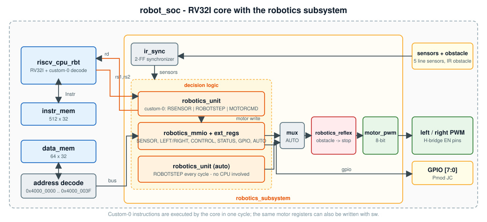

# Robotics subsystem



The robotics subsystem turns the RV32I core into a small robot controller. It reads five line sensors and an
obstacle sensor, generates two 8-bit PWM motor signals, and can be driven three ways:

| Mode | Who steers | CPU involvement |
|---|---|---|
| **Memory-mapped** | software reads `SENSOR`, writes `LEFT_MOTOR` / `RIGHT_MOTOR` | one `lw`, a decision, two `sw` per update |
| **Custom instruction** | the `ROBOTSTEP` instruction (sense -> steer -> drive) | **one instruction** per update |
| **Autonomous** | hardware steering table, every cycle (`AUTO = 1`) | none - the CPU is free |

In every mode the **hardware reflex** can force both motors to zero when the obstacle sensor fires
(`CONTROL[0] = 1`), without any software in the loop.

## Modules (`rtl/robotics/`)

| Module | Role |
|---|---|
| `robotics_unit` | Combinational custom-instruction unit (opcode `custom-0`): `RSENSOR`, `ROBOTSTEP`, `MOTORCMD` |
| `robotics_mmio` | Memory-mapped registers: sensor, motor commands, control, status |
| `robotics_ext_regs` | Extension registers: GPIO and the `AUTO` bit (does not touch the base map) |
| `robotics_reflex` | Obstacle emergency stop (registered), with `reflex_active` and a rising-edge `reflex_event` |
| `robotics_motor_pwm` | Free-running 8-bit counter compared with each motor command (counter / comparator PWM) |
| `ir_sync` | Two-flop synchronizer for the asynchronous sensor inputs |
| `robotics_subsystem` | Integration of the above; this is what `robot_soc` instantiates |
| `robotics_top` | Standalone, CPU-free robotics system (used by `tb_robotics_top`) |

## Register map (base `0x4000_0000`, word access)

| Address | Name | Access | Bits | Meaning |
|---|---|---|---|---|
| `0x00` | `SENSOR` | RO | `[4:0]` | `{far-left, left, center, right, far-right}`, 1 = line seen |
| `0x04` | `LEFT_MOTOR` | RW | `[7:0]` | left duty, 0 = stopped, 255 = full |
| `0x08` | `RIGHT_MOTOR` | RW | `[7:0]` | right duty |
| `0x0C` | `CONTROL` | RW | `[0]` | hardware reflex enable (obstacle -> motors stop) |
| `0x10` | `STATUS` | RO | `[0]` | reflex currently active |
| `0x14` | `GPIO_OUT` | RW | `[7:0]` | output latch |
| `0x18` | `GPIO_DIR` | RW | `[7:0]` | 1 = pin is an output |
| `0x1C` | `GPIO_IN` | RO | `[7:0]` | synchronised pin levels |
| `0x20` | `AUTO` | RW | `[0]` | 1 = autonomous hardware line-follow |

## Custom instructions

R-type, opcode `custom-0` = `0001011`, `funct7 = 0`.

```
 31      25 24  20 19  15 14  12 11   7 6      0
 | funct7 | rs2  | rs1  | f3   |  rd  | 0001011 |
```

| `funct3` | Mnemonic | Operation |
|---|---|---|
| `000` | `RSENSOR rd` | `rd <= {27'b0, sensors}` |
| `001` | `ROBOTSTEP rd` | steer from the sensors, update both motor registers, `rd <= {16'b0, left, right}` |
| `010` | `MOTORCMD rs1, rs2` | `left <= rs1[7:0]`, `right <= rs2[7:0]` |

The standard GNU assembler does not know these names; `programs/bench/rbt_regs.inc` defines them as macros
(`.insn r 0x0b, <funct3>, 0, rd, rs1, rs2`).

## Steering table

| Sensors `{FL,L,C,R,FR}` | Left | Right | Meaning |
|---|---|---|---|
| `00100` | 70 | 70 | centered |
| `01000` | 50 | 75 | line left -> turn left |
| `10000` | 30 | 80 | line far left -> sharp left |
| `00010` | 75 | 50 | line right |
| `00001` | 80 | 30 | line far right |
| `00000` | 0 | 0 | line lost -> stop |
| `11111` | 70 | 70 | junction -> straight |
| several active | | | outermost sensor wins: far-left, far-right, left, right, center |

## Changes to the RV32I core (`rtl/robot_cpu/`)

`rtl/t1_riscv_cpu` is untouched. The robotics variant is a copy with four small edits:

1. `main_decoder_rbt` - decodes opcode `0001011`: `RegWrite = 1`, `ResultSrc = 11`, plus a `Custom` output.
2. `controller_rbt` - forwards `Custom`.
3. `datapath_rbt` - the result mux gains a fourth input (the robotics unit result); simulation debug prints removed.
4. `datapath_rbt` - **`lui` fix**: operand A is forced to 0 for `lui`. The original core adds the register named by
   instruction bits [19:15] (immediate bits for U-type), which is only harmless when that register happens to be zero.

`tb/robotics/t1_wrapper_rbt.v` runs the original 38-check testbench against this variant: 0 faulty instructions.

## Design notes and limits

- **No reverse.** PWM carries an 8-bit duty only; the Basys 3 top ties the H-bridge direction pins to "forward".
- **PWM frequency = f_cpu / 256.** The default board build clocks the CPU at 6.25 MHz (100 MHz / 16), giving 24.4 kHz,
  which suits L298N / TB6612-class drivers. `DIV_BIT` on the top-level selects other rates.
- **No interrupts.** `reflex_event` is exported for a future interrupt controller; software polls `STATUS` today.
- **Sensor inputs are only synchronised**, not debounced. Digital IR modules are normally clean; add filtering for
  noisy sensors.
- **Unspecified patterns.** Sensor combinations beyond the five single-sensor cases follow the rule in the table above.
