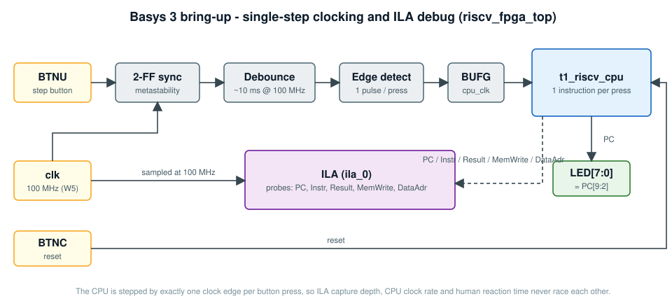

# Basys 3 bring-up

Part: `xc7a35tcpg236-1` | Tool: Vivado 2025.1 | Top: `riscv_fpga_top` | Constraints: `fpga/basys3/basys3.xdc`



## Clocking strategy: single-step

The CPU is stepped one instruction per press of **BTNU**: 2-FF synchronizer -> ~10 ms debounce -> rising-edge detect ->
one-cycle pulse through a `BUFG` as `cpu_clk`. This removes any race between CPU clock rate, ILA capture depth and human
reaction time. The ILA runs on the free-running 100 MHz clock so the debug hub stays reachable over JTAG.

| Pin | Function |
|---|---|
| W5 | 100 MHz clock |
| U18 (BTNC) | reset |
| T18 (BTNU) | single-step |
| U16 ... V14 | `LED[7:0]` = `PC[9:2]` |

## Implementation results (`impl_1`)

Source reports: `fpga/basys3/reports/`.

| Resource | Used | Available | % |
|---|---|---|---|
| Slice LUTs | 2,576 | 20,800 | 12.4 |
| Slice registers | 2,585 | 41,600 | 6.2 |
| Block RAM tiles | 14.5 | 50 | 29.0 |
| DSP | 0 | 90 | 0 |
| Bonded IOB | 11 | 106 | 10.4 |

All figures include the ILA core and debug hub. Estimated power 0.099 W (vectorless), junction temperature 25.5 C.

## Timing

| Domain | WNS | Status |
|---|---|---|
| `sys_clk_pin` (100 MHz) | +1.287 ns | met |
| JTAG TCK (debug hub) | +26.024 ns | met |
| `cpu_clk` (declared /128) | +1263.6 ns | met (constraint is deliberately loose) |
| `cpu_clk` -> `sys_clk_pin` | **-6.758 ns**, 129 endpoints | not met |

**Interpretation.** The 129 failing endpoints equal the ILA probe width (PC 32 + Instr 32 + Result 32 + DataAdr 32 +
MemWrite 1). They are CPU-state signals launched on `cpu_clk` and sampled by the 100 MHz ILA, so the single-cycle
combinational path (~13.6 ns) is analysed against a 10 ns capture period. Functionally this is harmless in single-step
mode: the signals are stable long before the next button press and the ILA simply captures the settled value.

**Recommended clean-up** (not yet applied to `basys3.xdc`): declare the debug-capture crossing explicitly, e.g.

```tcl
set_false_path -from [get_clocks cpu_clk] -to [get_clocks sys_clk_pin]
```

or move the ILA onto `cpu_clk` with a fast sample clock. The honest performance limit of this core is its
combinational path: **~73 MHz**, which is the motivation for the pipelined version.

## Two files differ from `rtl/`

The Vivado build uses two variants kept in `fpga/basys3/rtl_overrides/`:

| File | Difference |
|---|---|
| `t1_riscv_cpu.v` | exposes `Instr` as an output so the ILA can probe it |
| `reg_file.v` | zero-initialised array via `initial`, plain write-enable (reads of `x0` still return 0) |

The simulation reference in `rtl/t1_riscv_cpu` is unchanged.
